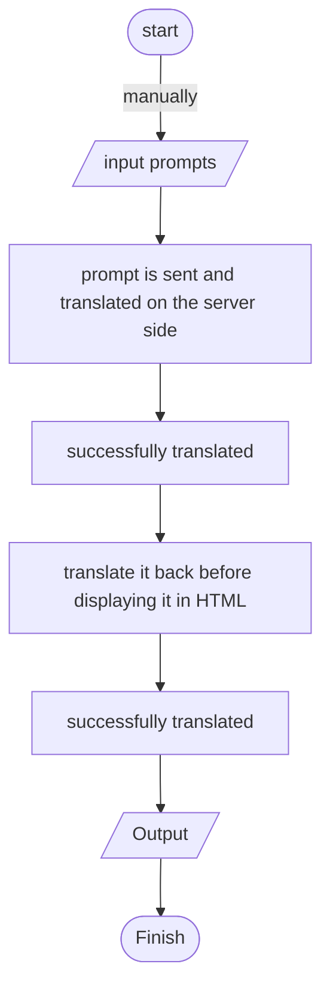

# SphardAI

SphardAI is an AI created using unofficial GB token for secure authentication. It provides a strong and secure solution to implement AI-based solutions for various applications.

### Installation

Install the required module(s):

```bash
pip install -r requirements.txt
npm install
```

Run Tailwindcss and the `brd.py` file on separate terminals:

```bash
# Tailwindcss
npm run dev

# brd.py
python3 brd.py
```

rename `.env-example` file to `.env` file and put your token.

### Costumize service URL

You can use another google translate domain for translation. If multiple URLs are provided it then randomly chooses a domain.

```python
translator = Translator(service_urls=[
      'translate.google.com',
      'translate.google.co.kr',
    ])
```

### Select your Language

input and output, you can change as you like.

```python
...
translated_command = translator.translate(command, src='id', dest='en').text
...
output = translator.translate(translated_output, src='en', dest='id').text
...
```

### Algorithms



### SCC (Sloc, Cloc, and Code)

```bash
───────────────────────────────────────────────────────────────────────────────
Language                 Files     Lines   Blanks  Comments     Code Complexity
───────────────────────────────────────────────────────────────────────────────
JSON                         2        81        0         0       81          0
JavaScript                   2        14        2         0       12          1
HTML                         1        67        4         0       63          0
License                      1        21        4         0       17          0
Markdown                     1        84       20         0       64          0
Plain Text                   1        23        0         0       23          0
Python                       1        33        5         0       28          0
gitignore                    1       294       64        92      138          0
───────────────────────────────────────────────────────────────────────────────
Total                       10       617       99        92      426          1
───────────────────────────────────────────────────────────────────────────────
Estimated Cost to Develop (organic) $11,027
Estimated Schedule Effort (organic) 2.48 months
Estimated People Required (organic) 0.39
───────────────────────────────────────────────────────────────────────────────
Processed 16412 bytes, 0.016 megabytes (SI)
───────────────────────────────────────────────────────────────────────────────
```

---

[MIT License](./LICENSE)
